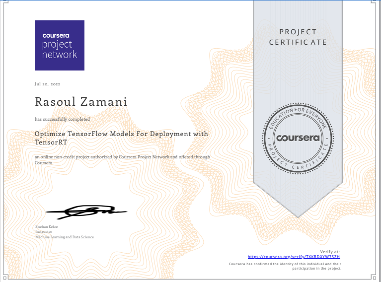

# Edu_TensorRT
# Hands on TensorRT

TensorRT is a machine learning framework that is published by Nvidia to run inference that is machine learning inference on their hardware. TensorRT is highly optimized to run on NVIDIA GPUs.

In this repo I suggeting free course from coursera for hands on tensorrt:

https://www.coursera.org/projects/tensorflow-tensorrt

it takes about 2 houre to complit the course, also I provided completed colab notebook for this course in:

[colab notebook](Optimize_TensorFlow_Models_For_Deployment_with_TensorRT.ipynb)

for more information about tensorrt you can see:

https://developer.nvidia.com/tensorrt

maybe it encourage you (!) that after passing course seccessfully you will get certification like this:

